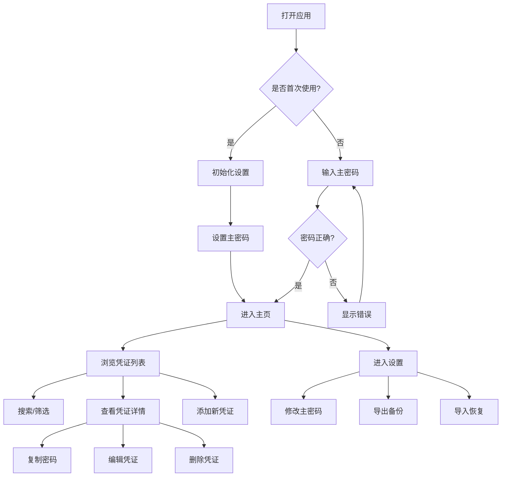

# remember 产品需求文档（PRD）

## 1. 产品概述

**remember** 是一个私密的个人数字档案库，用于安全存储和管理用户的密码、习惯、知识、梦想、人际关系、遗产等重要信息。项目采用本地优先、隐私保护的设计理念，让用户完全掌控自己的数字存在。

- **目标用户**：注重隐私的个人用户，希望安全管理数字生活的人群
- **核心价值**：数据主权回归、隐私保护、数字传承
- **市场定位**：本地优先的个人数据管理工具，替代云端依赖的密码管理器

## 2. 核心功能

### 2.1 用户角色

本项目为单用户应用，无需角色区分。

| 角色 | 说明 | 核心权限 |
|------|------|----------|
| 用户 | 应用的唯一使用者 | 完全控制所有数据 |

### 2.2 功能模块

**第一阶段（MVP）核心功能：**

1. **认证系统**：主密码登录、密码强度验证、自动锁定
2. **凭证管理**：密码条目的增删改查、分类管理、标签系统
3. **数据加密**：AES-256-GCM 加密敏感数据、本地安全存储
4. **搜索功能**：全文搜索、分类筛选、标签过滤
5. **导入导出**：加密导出备份、导入恢复功能

### 2.3 页面详情

| 页面名称 | 模块名称 | 功能描述 |
|----------|----------|----------|
| 登录页 | 主密码输入 | 输入主密码解锁应用，支持密码强度提示 |
| 登录页 | 初始化设置 | 首次使用时设置主密码和安全提示 |
| 主页 | 凭证列表 | 显示所有密码条目，支持搜索和筛选 |
| 主页 | 快速操作 | 添加新凭证、导入导出、设置 |
| 凭证详情 | 信息展示 | 显示凭证的完整信息（解密后） |
| 凭证详情 | 编辑表单 | 修改凭证信息，支持密码生成器 |
| 凭证详情 | 安全操作 | 复制密码/用户名、删除凭证 |
| 设置页 | 安全设置 | 修改主密码、自动锁定时间、剪贴板清除时间 |
| 设置页 | 数据管理 | 导入导出、清除数据、关于信息 |

## 3. 核心流程

### 3.1 主要用户流程

**首次使用流程：**
1. 用户打开应用
2. 进入初始化设置页面
3. 设置主密码（包含强度验证）
4. 设置安全提示（可选）
5. 进入主页，开始使用

**日常使用流程：**
1. 用户打开应用
2. 输入主密码解锁
3. 浏览或搜索凭证列表
4. 点击凭证查看详情
5. 复制密码或编辑凭证
6. 使用完毕后锁定应用

**备份恢复流程：**
1. 用户进入设置页面
2. 选择导出功能
3. 输入主密码确认
4. 下载加密备份文件
5. （恢复时）选择导入功能
6. 选择备份文件并输入密码
7. 数据恢复完成

## 4. 用户界面设计

### 4.1 设计风格

**整体风格：** 简洁、专业、安全感

- **主色调**：深蓝色 (#1e3a5f) - 代表信任和安全
- **辅助色**：浅灰色 (#f5f5f5) - 背景和卡片
- **强调色**：绿色 (#22c55e) - 成功状态和确认操作
- **警告色**：红色 (#ef4444) - 删除和危险操作
- **字体**：
  - 标题：Inter 或系统默认无衬线字体
  - 正文：系统默认字体
  - 密码：等宽字体（如 JetBrains Mono）
- **按钮风格**：圆角按钮，主要按钮使用主色调，次要按钮使用边框样式
- **布局风格**：卡片式布局，左侧导航或顶部导航
- **图标风格**：简洁的线性图标，配合密码锁、钥匙等安全相关图标

### 4.2 页面设计概览

| 页面名称 | 模块名称 | UI 元素 |
|----------|----------|---------|
| 登录页 | 主密码输入 | 居中卡片布局，大号密码输入框，品牌 Logo，渐变背景 |
| 主页 | 凭证列表 | 网格或列表布局，搜索栏，分类标签，卡片式凭证项 |
| 主页 | 快速操作 | 浮动操作按钮（FAB），下拉菜单 |
| 凭证详情 | 信息展示 | 卡片式布局，字段标签，复制按钮，密码遮罩 |
| 凭证详情 | 编辑表单 | 表单输入，密码生成器，强度指示器 |
| 设置页 | 设置项 | 分组列表，开关控件，下拉选择 |

### 4.3 响应式设计

- **桌面优先**：主要针对桌面浏览器优化
- **平板适配**：调整布局为两列或单列
- **移动适配**：完全单列布局，增大触控区域
- **PWA 支持**：支持安装到主屏幕，离线使用

### 4.4 交互细节

- **密码遮罩**：默认显示为圆点，点击显示明文
- **复制反馈**：复制成功后显示短暂提示
- **自动锁定**：闲置一定时间后自动锁定
- **剪贴板清除**：复制密码后自动清除剪贴板
- **键盘快捷键**：支持 Ctrl+C 复制，Ctrl+F 搜索等
