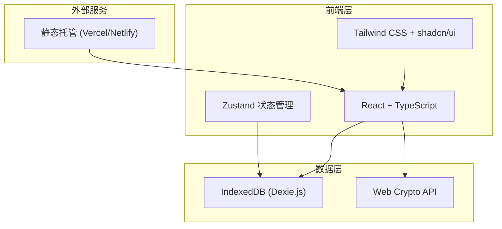
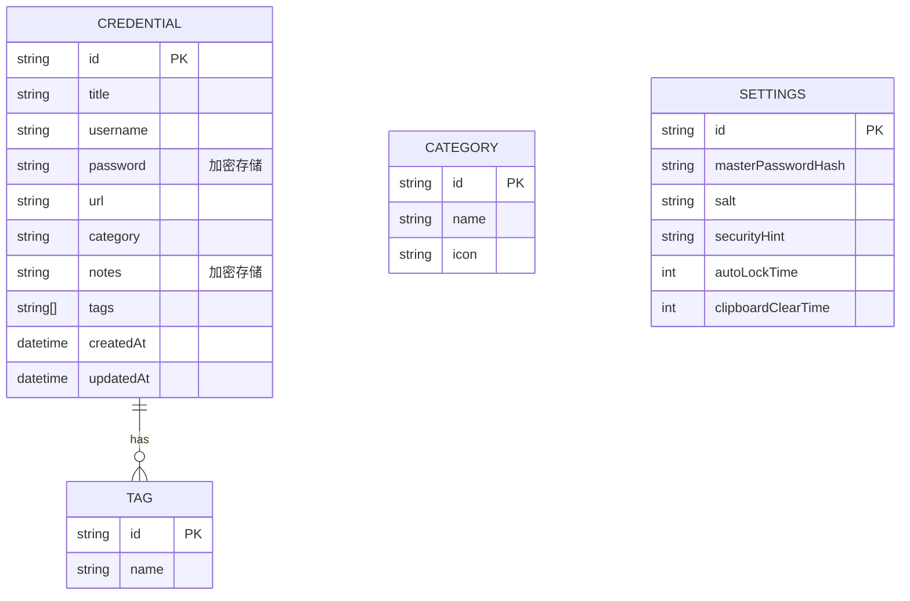

# remember 技术架构文档

## 1. 架构设计



## 2. 技术描述

- **前端框架**：React 18 + TypeScript
- **构建工具**：Vite
- **UI 框架**：Tailwind CSS 3 + shadcn/ui
- **状态管理**：Zustand
- **本地数据库**：IndexedDB (通过 Dexie.js 封装)
- **加密方案**：Web Crypto API (AES-256-GCM)
- **部署方式**：静态托管 (Vercel/Netlify)

## 3. 路由定义

| 路由 | 用途 |
|------|------|
| / | 首页，重定向到 /login 或 /dashboard |
| /login | 登录/初始化页面 |
| /dashboard | 主页，显示凭证列表 |
| /credential/:id | 凭证详情/编辑页面 |
| /settings | 设置页面 |

## 4. 数据模型

### 4.1 数据模型定义



### 4.2 数据定义语言

```typescript
// src/lib/types.ts

export interface Credential {
    id?: string;
    title: string;
    username?: string;
    password: string; // 加密存储
    url?: string;
    category?: string;
    notes?: string; // 加密存储
    tags: string[];
    createdAt: Date;
    updatedAt: Date;
}

export interface Category {
    id?: string;
    name: string;
    icon?: string;
}

export interface Tag {
    id?: string;
    name: string;
}

export interface AppSettings {
    id?: string;
    masterPasswordHash: string;
    salt: string;
    securityHint?: string;
    autoLockTime: number; // 分钟
    clipboardClearTime: number; // 秒
}

export interface EncryptedData {
    iv: string;
    data: string;
}

export interface ExportData {
    version: string;
    exportDate: Date;
    credentials: Credential[];
    categories: Category[];
    tags: Tag[];
    settings: Omit<AppSettings, 'masterPasswordHash' | 'salt'>;
}
```

## 5. 项目结构

```
remember/
├── src/
│   ├── components/         # React 组件
│   │   ├── ui/             # shadcn/ui 基础组件
│   │   │   ├── button.tsx
│   │   │   ├── input.tsx
│   │   │   ├── card.tsx
│   │   │   ├── dialog.tsx
│   │   │   ├── dropdown-menu.tsx
│   │   │   ├── toast.tsx
│   │   │   └── ...
│   │   ├── auth/           # 认证相关组件
│   │   │   ├── LoginForm.tsx
│   │   │   ├── SetupForm.tsx
│   │   │   └── PasswordStrength.tsx
│   │   ├── credentials/    # 凭证管理组件
│   │   │   ├── CredentialList.tsx
│   │   │   ├── CredentialCard.tsx
│   │   │   ├── CredentialDetail.tsx
│   │   │   ├── CredentialForm.tsx
│   │   │   ├── PasswordGenerator.tsx
│   │   │   └── SearchBar.tsx
│   │   ├── layout/         # 布局组件
│   │   │   ├── Header.tsx
│   │   │   ├── Sidebar.tsx
│   │   │   └── MainLayout.tsx
│   │   └── settings/       # 设置组件
│   │       ├── SettingsPage.tsx
│   │       ├── SecuritySettings.tsx
│   │       └── DataManagement.tsx
│   ├── hooks/              # 自定义 Hooks
│   │   ├── useAuth.ts
│   │   ├── useCredentials.ts
│   │   ├── useCrypto.ts
│   │   ├── useAutoLock.ts
│   │   └── useClipboard.ts
│   ├── lib/                # 工具库
│   │   ├── crypto.ts       # 加密工具
│   │   ├── database.ts     # 数据库操作
│   │   ├── utils.ts        # 通用工具函数
│   │   └── types.ts        # TypeScript 类型定义
│   ├── stores/             # Zustand 状态管理
│   │   ├── authStore.ts
│   │   ├── credentialStore.ts
│   │   └── settingsStore.ts
│   ├── pages/              # 页面组件
│   │   ├── LoginPage.tsx
│   │   ├── DashboardPage.tsx
│   │   ├── CredentialDetailPage.tsx
│   │   └── SettingsPage.tsx
│   ├── App.tsx             # 主应用组件
│   ├── main.tsx            # 入口文件
│   └── index.css           # 全局样式
├── public/                 # 静态资源
│   ├── favicon.ico
│   └── manifest.json
├── .trae/
│   └── documents/          # 项目文档
├── package.json
├── vite.config.ts
├── tsconfig.json
├── tailwind.config.js
├── postcss.config.js
├── components.json         # shadcn/ui 配置
└── README.md
```

## 6. 核心模块实现

### 6.1 加密模块

```typescript
// src/lib/crypto.ts

export class CryptoManager {
    private key: CryptoKey | null = null;
    private encoder = new TextEncoder();
    private decoder = new TextDecoder();

    // 从主密码派生加密密钥
    async deriveKey(password: string, salt: Uint8Array): Promise<CryptoKey> {
        const keyMaterial = await crypto.subtle.importKey(
            'raw',
            this.encoder.encode(password),
            'PBKDF2',
            false,
            ['deriveBits', 'deriveKey']
        );

        return crypto.subtle.deriveKey(
            {
                name: 'PBKDF2',
                salt,
                iterations: 100000,
                hash: 'SHA-256'
            },
            keyMaterial,
            { name: 'AES-GCM', length: 256 },
            true,
            ['encrypt', 'decrypt']
        );
    }

    // 加密数据
    async encrypt(data: string): Promise<EncryptedData> {
        if (!this.key) throw new Error('密钥未初始化');

        const iv = crypto.getRandomValues(new Uint8Array(12));
        const encrypted = await crypto.subtle.encrypt(
            { name: 'AES-GCM', iv },
            this.key,
            this.encoder.encode(data)
        );

        return {
            iv: this.arrayBufferToBase64(iv),
            data: this.arrayBufferToBase64(encrypted)
        };
    }

    // 解密数据
    async decrypt(encryptedData: EncryptedData): Promise<string> {
        if (!this.key) throw new Error('密钥未初始化');

        const iv = this.base64ToArrayBuffer(encryptedData.iv);
        const data = this.base64ToArrayBuffer(encryptedData.data);

        const decrypted = await crypto.subtle.decrypt(
            { name: 'AES-GCM', iv },
            this.key,
            data
        );

        return this.decoder.decode(decrypted);
    }

    // 生成随机盐值
    generateSalt(): Uint8Array {
        return crypto.getRandomValues(new Uint8Array(16));
    }

    // 辅助函数：ArrayBuffer 转 Base64
    private arrayBufferToBase64(buffer: ArrayBuffer | Uint8Array): string {
        const bytes = new Uint8Array(buffer);
        let binary = '';
        for (let i = 0; i < bytes.byteLength; i++) {
            binary += String.fromCharCode(bytes[i]);
        }
        return btoa(binary);
    }

    // 辅助函数：Base64 转 ArrayBuffer
    private base64ToArrayBuffer(base64: string): ArrayBuffer {
        const binary = atob(base64);
        const bytes = new Uint8Array(binary.length);
        for (let i = 0; i < binary.length; i++) {
            bytes[i] = binary.charCodeAt(i);
        }
        return bytes.buffer;
    }
}
```

### 6.2 数据库模块

```typescript
// src/lib/database.ts

import Dexie, { Table } from 'dexie';
import { Credential, Category, Tag, AppSettings } from './types';

export class RememberDatabase extends Dexie {
    credentials!: Table<Credential, string>;
    categories!: Table<Category, string>;
    tags!: Table<Tag, string>;
    settings!: Table<AppSettings, string>;

    constructor() {
        super('remember-db');
        this.version(1).stores({
            credentials: 'id, title, username, url, category, *tags, createdAt, updatedAt',
            categories: 'id, name',
            tags: 'id, name',
            settings: 'id'
        });
    }
}

export const db = new RememberDatabase();

// 凭证服务
export class CredentialService {
    // 添加凭证
    static async add(credential: Omit<Credential, 'id' | 'createdAt' | 'updatedAt'>): Promise<string> {
        const id = crypto.randomUUID();
        const now = new Date();
        await db.credentials.add({
            ...credential,
            id,
            createdAt: now,
            updatedAt: now
        });
        return id;
    }

    // 更新凭证
    static async update(id: string, data: Partial<Credential>): Promise<void> {
        await db.credentials.update(id, {
            ...data,
            updatedAt: new Date()
        });
    }

    // 删除凭证
    static async delete(id: string): Promise<void> {
        await db.credentials.delete(id);
    }

    // 获取凭证
    static async getById(id: string): Promise<Credential | undefined> {
        return db.credentials.get(id);
    }

    // 获取所有凭证
    static async getAll(): Promise<Credential[]> {
        return db.credentials.toArray();
    }

    // 搜索凭证
    static async search(query: string): Promise<Credential[]> {
        const lowerQuery = query.toLowerCase();
        return db.credentials
            .filter(cred =>
                cred.title.toLowerCase().includes(lowerQuery) ||
                cred.username?.toLowerCase().includes(lowerQuery) ||
                cred.url?.toLowerCase().includes(lowerQuery) ||
                cred.category?.toLowerCase().includes(lowerQuery)
            )
            .toArray();
    }

    // 按分类筛选
    static async getByCategory(category: string): Promise<Credential[]> {
        return db.credentials.where('category').equals(category).toArray();
    }

    // 按标签筛选
    static async getByTag(tag: string): Promise<Credential[]> {
        return db.credentials.where('tags').equals(tag).toArray();
    }
}
```

### 6.3 状态管理模块

```typescript
// src/stores/authStore.ts

import { create } from 'zustand';
import { CryptoManager } from '../lib/crypto';
import { db } from '../lib/database';

interface AuthState {
    isAuthenticated: boolean;
    isInitialized: boolean;
    crypto: CryptoManager;
    login: (password: string) => Promise<boolean>;
    setup: (password: string, hint?: string) => Promise<void>;
    logout: () => void;
    checkInitialized: () => Promise<void>;
}

export const useAuthStore = create<AuthState>((set, get) => ({
    isAuthenticated: false,
    isInitialized: false,
    crypto: new CryptoManager(),

    login: async (password: string) => {
        try {
            const settings = await db.settings.get('main');
            if (!settings) return false;

            const salt = new Uint8Array(atob(settings.salt).split('').map(c => c.charCodeAt(0)));
            const key = await get().crypto.deriveKey(password, salt);

            // 验证密码（尝试解密一个测试数据）
            // 这里简化处理，实际应该验证密码哈希
            set({ isAuthenticated: true });
            return true;
        } catch {
            return false;
        }
    },

    setup: async (password: string, hint?: string) => {
        const crypto = get().crypto;
        const salt = crypto.generateSalt();
        const key = await crypto.deriveKey(password, salt);

        await db.settings.put({
            id: 'main',
            masterPasswordHash: btoa(String.fromCharCode(...salt)), // 简化的哈希
            salt: btoa(String.fromCharCode(...salt)),
            securityHint: hint,
            autoLockTime: 5,
            clipboardClearTime: 30
        });

        set({ isAuthenticated: true, isInitialized: true });
    },

    logout: () => {
        set({ isAuthenticated: false });
    },

    checkInitialized: async () => {
        const settings = await db.settings.get('main');
        set({ isInitialized: !!settings });
    }
}));
```

## 7. 安全设计

### 7.1 加密流程

1. 用户设置主密码
2. 使用 PBKDF2 从主密码派生加密密钥（100,000 次迭代）
3. 敏感数据使用 AES-256-GCM 加密
4. 加密数据存储在本地 IndexedDB
5. 导出时整体加密备份文件

### 7.2 安全特性

- **零知识架构**：服务器无法访问用户数据
- **本地优先**：数据默认不离开设备
- **自动锁定**：闲置后自动锁定应用
- **安全剪贴板**：复制后自动清除剪贴板
- **内存保护**：敏感数据使用后清除

### 7.3 密码强度验证

```typescript
// src/lib/passwordStrength.ts

export interface PasswordStrength {
    score: number; // 0-4
    label: string;
    color: string;
}

export function checkPasswordStrength(password: string): PasswordStrength {
    let score = 0;

    if (password.length >= 8) score++;
    if (password.length >= 12) score++;
    if (/[a-z]/.test(password) && /[A-Z]/.test(password)) score++;
    if (/\d/.test(password)) score++;
    if (/[^a-zA-Z0-9]/.test(password)) score++;

    const levels: PasswordStrength[] = [
        { score: 0, label: '非常弱', color: '#ef4444' },
        { score: 1, label: '弱', color: '#f97316' },
        { score: 2, label: '中等', color: '#eab308' },
        { score: 3, label: '强', color: '#22c55e' },
        { score: 4, label: '非常强', color: '#16a34a' }
    ];

    return levels[Math.min(score, 4)];
}
```

## 8. 开发环境

### 8.1 依赖包

```json
{
    "dependencies": {
        "react": "^18.2.0",
        "react-dom": "^18.2.0",
        "react-router-dom": "^6.20.0",
        "dexie": "^3.2.4",
        "dexie-react-hooks": "^1.1.7",
        "zustand": "^4.4.7",
        "@radix-ui/react-dialog": "^1.0.5",
        "@radix-ui/react-dropdown-menu": "^2.0.6",
        "@radix-ui/react-toast": "^1.1.5",
        "class-variance-authority": "^0.7.0",
        "clsx": "^2.0.0",
        "tailwind-merge": "^2.0.0",
        "lucide-react": "^0.294.0"
    },
    "devDependencies": {
        "@types/react": "^18.2.43",
        "@types/react-dom": "^18.2.17",
        "@vitejs/plugin-react": "^4.2.1",
        "autoprefixer": "^10.4.16",
        "postcss": "^8.4.32",
        "tailwindcss": "^3.3.6",
        "typescript": "^5.2.2",
        "vite": "^5.0.8"
    }
}
```

### 8.2 环境变量

本项目无需环境变量，所有配置均为本地配置。
